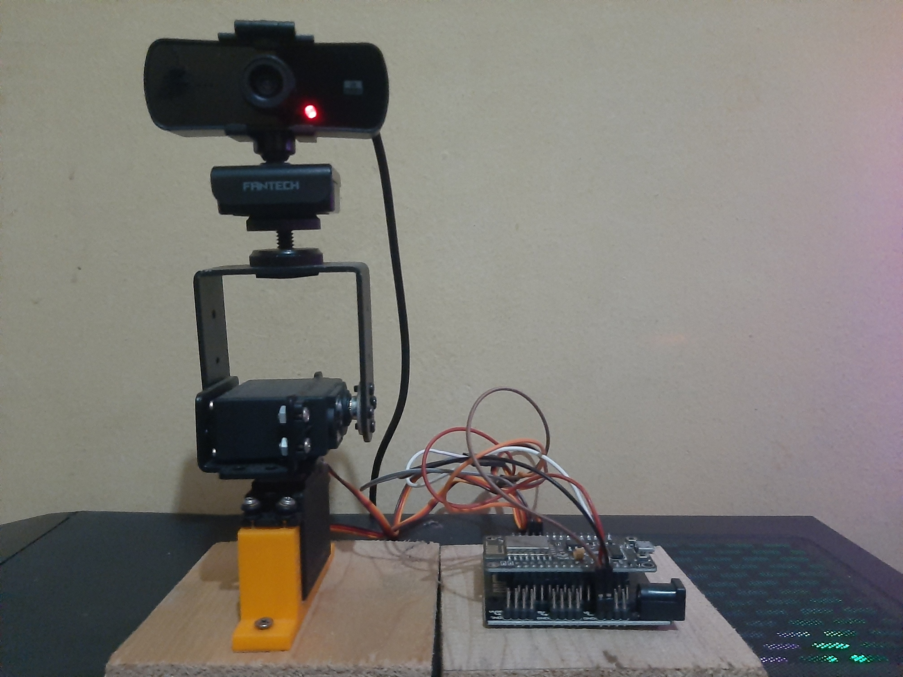
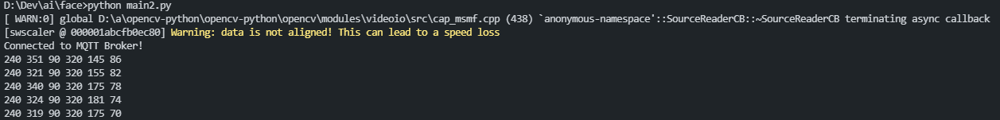

# CenterBot

Arduino based project for centering your face on video conference

## Description

This project using Haar cascade classifier for detecting face, and then sending the detected (X,Y) position through MQTT to Arduino for calculating servo movement.

## Getting Started

### Dependencies

* 2x Servo MG996R
* 1x Set Servo Bracket for MG996R
* 1x NodeMCU V3
* 1x NodeMCU Base Plate
* 1x WebCam

---

### Installing

* Install the project like this image below



```
Note make sure use external power source for servo, e.g in this example i use NodeMCU BaseBoard and then use power from DC Jack for servo (5V, 2A)
```

* Upload code in arduino/main.ino to your NodeMCU
```
make sure you already install the library needed 
e.g ESP8266WiFi, PubSubClient, ArduinoJson, Servo and then change the variable in the code for WiFi setting and MQTT server and channel. 
```

* Install the library for python by executing 
```bash
cd client
pip install -r requirements.txt
```
```
Modified the channel name and video capture source in main.py
```

---
### Executing program

```
Now plug your NodeMCU to power source, and then run the main.py file on your PC/Laptop
```
```bash
python main.py
```


```
now its properly working and will send the data from your PC to NodemCU thorugh MQTT
like gif video below
```

